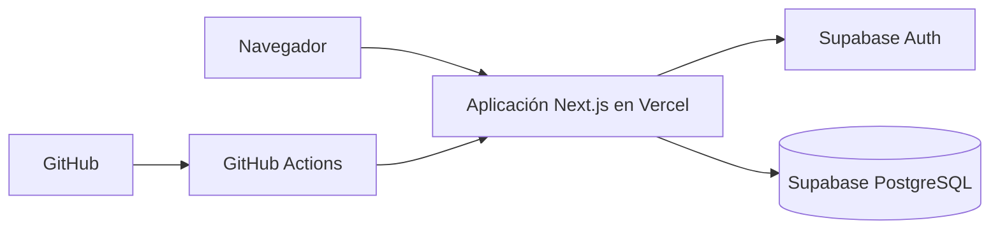

# Arquitectura física

```mermaid
flowchart LR
  Browser[Navegador] --> Vercel[Aplicación Next.js en Vercel]
  Vercel --> Auth[Supabase Auth]
  Vercel --> DB[(Supabase PostgreSQL)]
  GitHub[GitHub] --> CI[GitHub Actions]
  CI --> Vercel
```

Vercel y Supabase figuran como destinos previstos. Todavía no hay despliegue ni proyecto Supabase conectado y verificado. Storage queda fuera del MVP inicial.
